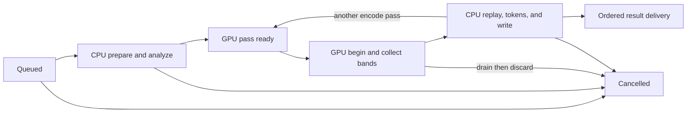

# Asynchronous multi-image encoder design

## Decision

Do not implement multi-image overlap by running independent `WebPEncode()`
calls concurrently. Introduce an encoder-owned asynchronous queue and a
per-encode accelerator session first. The initial scheduler keeps one GPU pass
in flight and overlaps it with CPU work from other images. It may add multiple
GPU slots only after profiling proves that concurrent kernels help.

This is a design gate, not a committed public API. Names and layouts below are
a versioned API sketch. The first implementation should remain private until
the correctness, cancellation, memory, and performance gates at the end of
this document pass.

## Evidence and constraints

On the Ryzen 9 3900X / RTX 2080 SUPER, CPU lossy analysis takes 10.0--12.0 ms
per 1600x1200 image and CUDA decimation takes 34--60 ms. There is enough CPU
work to overlap with device work. A two-worker benchmark prototype improved
its first PNG pass from 100.4 to 81.1 ms/image, but changed both the bitstream
hash and byte count and then failed the deterministic-output check.

The failure follows from the current ownership model:

- `WebPCUDALossyDecimate()` has one process-global pending pass, arena, stream,
  copy stream, and set of band events. A second `BEGIN` abandons the first
  uncollected pass. Same-shaped jobs can then satisfy the shape checks and
  collect another job's buffers.
- CUDA RGB/YUV and fused-analysis handoffs are process-global. The current
  `end_encode(context)` clears them without identifying which encode ended.
- The common dispatcher stores configuration in thread-local state, but the
  backend state it selects is not scoped to that thread or encode.
- `WebPPicture` contains caller callbacks and mutable output fields. Invoking
  those asynchronously without a new lifetime contract would be unsafe.

The existing synchronous `WebPEncode()` contract must remain unchanged. Queue
scheduling must produce the exact bytes that serial calls produce under the
same backend policy, including after a recoverable accelerator failure.

## Proposed public shape

The queue returns owned in-memory results. Version 1 deliberately excludes
writer and progress callbacks; polling is safe from any caller thread and
does not execute caller code on an encoder worker.

```c
typedef struct WebPAsyncEncoder WebPAsyncEncoder;
typedef uint64_t WebPAsyncEncodeId;

typedef struct {
  int max_in_flight;             /* 0 selects a bounded implementation default */
  uint64_t max_owned_input_bytes;/* 0 selects a bounded implementation default */
  uint32_t pad[6];
} WebPAsyncEncoderOptions;

typedef enum {
  WEBP_ASYNC_SUBMIT_OK = 0,
  WEBP_ASYNC_SUBMIT_QUEUE_FULL,
  WEBP_ASYNC_SUBMIT_INVALID,
  WEBP_ASYNC_SUBMIT_OUT_OF_MEMORY
} WebPAsyncSubmitStatus;

typedef enum {
  WEBP_ASYNC_ENCODE_QUEUED = 0,
  WEBP_ASYNC_ENCODE_RUNNING,
  WEBP_ASYNC_ENCODE_OK,
  WEBP_ASYNC_ENCODE_FAILED,
  WEBP_ASYNC_ENCODE_CANCELLED
} WebPAsyncEncodeStatus;

typedef struct {
  WebPAsyncEncodeId id;
  uint64_t user_tag;
  uint64_t submission_index;
  WebPAsyncEncodeStatus status;
  WebPEncodingError error_code;
  uint8_t* bytes;                /* owned; clear with the function below */
  size_t size;
  uint32_t pad[6];
} WebPAsyncEncodeResult;

WebPAsyncEncoder* WebPAsyncEncoderNewInternal(
    const WebPAsyncEncoderOptions* options, int encoder_abi_version);

WebPAsyncSubmitStatus WebPAsyncEncoderSubmitCopy(
    WebPAsyncEncoder* encoder, const WebPConfig* config,
    const WebPPicture* input, uint64_t user_tag, WebPAsyncEncodeId* id);

int WebPAsyncEncoderPoll(WebPAsyncEncoder* encoder,
                         WebPAsyncEncodeId id,
                         WebPAsyncEncodeStatus* status, int* percent);

int WebPAsyncEncoderWaitNext(WebPAsyncEncoder* encoder, int timeout_ms,
                             WebPAsyncEncodeResult* result);

int WebPAsyncEncoderCancel(WebPAsyncEncoder* encoder,
                           WebPAsyncEncodeId id);
int WebPAsyncEncoderFlush(WebPAsyncEncoder* encoder);
void WebPAsyncEncodeResultClear(WebPAsyncEncodeResult* result);
void WebPAsyncEncoderDelete(WebPAsyncEncoder* encoder);
```

`SubmitCopy()` copies the `WebPConfig` and input pixels before returning. The
caller may then free or reuse its picture. It reads only picture input fields;
`writer`, `custom_ptr`, `stats`, `extra_info`, `progress_hook`, and output
error state are not copied or invoked. This cost is explicit and gives the
queue an unambiguous lifetime. A later zero-copy submit may be added with a
separate completion-owned lifetime contract, not a flag that weakens this one.

Submission is non-blocking. It returns `QUEUE_FULL` before copying when either
the job limit or owned-input-byte limit would be exceeded. `WaitNext()` returns
terminal results in submission order, even if later jobs finish first; this
preserves deterministic batch association. `Poll()` exposes progress without
calling user code. A timeout of zero polls and a negative timeout waits
indefinitely.

`Cancel()` immediately removes a queued job. Preparation and CPU finalization
check cancellation at existing progress boundaries. Submitted GPU work is not
forcefully terminated: it is drained safely, its result is discarded, and the
job becomes `CANCELLED`. `Delete()` requests cancellation, drains active work,
and frees undelivered results before returning. No worker survives the queue.

## Encoder and scheduler state

Each job owns its copied picture, `VP8Encoder`, alpha worker, token buffers,
accelerator session, memory writer, and error/progress state. No job stores a
pointer into another job or process-global temporary handoff.



The GPU coordinator is the only component allowed to begin or collect an
asynchronous accelerator pass. With one GPU slot, the useful sequence is:

1. CPU workers prepare/analyze N and N+1.
2. The coordinator begins and collects decimation for N.
3. After N's final band is copied to N-owned host buffers, the device arena is
   reusable. A CPU worker continues N's replay/token emission while the
   coordinator begins N+1.
4. Results enter an ordered delivery map. A slow earlier job applies
   backpressure rather than reordering visible results or growing memory
   without bound.

Multi-pass encodes cycle between `GPU pass ready` and CPU pass finalization.
Jobs that are ineligible for acceleration use the same state machine with a
CPU pass. Lossless support may use coarser internal stages, but it must obey the
same ownership and delivery contract.

## Accelerator ABI change

The private accelerator ABI must be bumped before the queue can interleave
encodes. Replace the implicit global active encode with an opaque session:

```c
typedef struct WebPAcceleratorEncodeSession WebPAcceleratorEncodeSession;

WebPAcceleratorResult (*begin_encode)(
    void* context, const WebPAcceleratorEncodeInfo* info,
    WebPAcceleratorEncodeSession** session);
void (*end_encode)(void* context,
                   WebPAcceleratorEncodeSession* session);
```

Every stage callback receives the session. The ordinary synchronous
`WebPEncode()` creates one session and destroys it on every exit path, so its
observable contract does not change. CUDA moves resident-pixel identity,
resident YUV, fused-analysis metadata, and other cross-stage handoffs from
`CudaState` into the session.

Lossy decimation additionally uses a backend-issued pass ticket. `BEGIN`
binds the ticket to a session, device arena generation, dimensions, and host
result buffers. `COLLECT` must present the same ticket; dimensions alone are
never identity. The backend rejects stale, foreign, duplicate, or
out-of-order collections transactionally. Job-owned host buffers remain alive
until the ticket is drained or cancelled.

The first backend implementation retains one decimate arena and one active
ticket. A condition/queue makes later `BEGIN` requests wait in the coordinator
instead of abandoning an active pass. Multiple arenas and streams are a later
capability bit and performance experiment, not part of the v1 requirement.
Immutable tables and device/module caches remain process-wide.

Backends that do not implement sessions are not used by the asynchronous
queue. The synchronous path may continue to use a compatibility adapter during
the private migration, but no public async release may silently use unsafe
global state.

## Errors, fallback, and determinism

- Accelerator `NOT_RUN` and `ERROR` retain their current transactional rules.
  A job replays the declined/failed stage on the CPU without affecting other
  jobs. Device quarantine makes later jobs decline cheaply.
- A decimate collection failure drains its ticket and continues the current
  image on the CPU from the documented band boundary. It cannot invalidate a
  different ticket.
- Queue allocation failure affects only the submitted job. An inability to
  allocate the result bitstream reports the usual WebP encoding error.
- A terminal result is immutable. Exactly one of delivery, cancellation, or
  queue destruction owns and frees its bitstream.
- For every accepted configuration, async output must be byte-for-byte equal
  to serial `WebPEncode()` using the same accelerator policy, input, and
  configuration. Repeated runs must also preserve output order and bytes.
- The scheduler never changes process environment variables. Backend policy
  is snapshotted into the job/session at submission.

## Implementation order

1. Refactor the lossy encoder into private prepare, per-pass decimate/replay,
   and finish operations while keeping `WebPEncode()` as a synchronous wrapper.
   Prove serial byte identity before adding threads.
2. Introduce accelerator sessions and decimate tickets. Move CUDA handoff
   fields into sessions and add stale/foreign-ticket tests.
3. Add a private two-job queue with one GPU coordinator and ordered in-memory
   results. Keep public headers and installed symbols unchanged.
4. Add bounded copying, cancellation, polling, teardown, failure injection,
   and CPU-only/unsupported-configuration paths.
5. Run the performance and correctness gates. Only then decide whether to
   publish a versioned API or retain the queue as a tool-only facility.

## Acceptance gates

- Serial-wrapper and async results match byte-for-byte across the canonical
  PNG/JPEG corpus, lossy/lossless/near-lossless, methods 0--6, odd dimensions,
  alpha, multiple passes, and every supported accelerator policy.
- Repeated batch sizes 1, 2, 4, 8, and 24 preserve submission order and exact
  hashes. Same-shaped concurrent jobs are mandatory regression coverage.
- Failure injection covers every decimate band, allocation points, device
  quarantine, cancellation in every state, queue-full behavior, timeout,
  flush, and deletion with work active.
- CPU-only sanitizer/TSAN runs report no races, leaks, use-after-free, or
  callbacks after deletion. CUDA stress runs exercise at least 10,000 mixed
  jobs without a hash change.
- Owned input, prepared encoder, device arena, and undelivered-result bytes
  stay within configured bounds under head-of-line blocking.
- Alternating-process measurements on the publication corpus show a repeated
  improvement greater than both 1.5 ms/image and 3% for batch sizes above one,
  with no material batch-one regression. Otherwise the queue remains private.

## Non-goals for version 1

Version 1 does not promise concurrent GPU kernels, arbitrary caller callbacks,
zero-copy input, cross-process device sharing, animation-frame reordering, or
a stable backend plugin ABI. Those can be evaluated after the single-GPU-slot
pipeline is correct and measurably useful.
